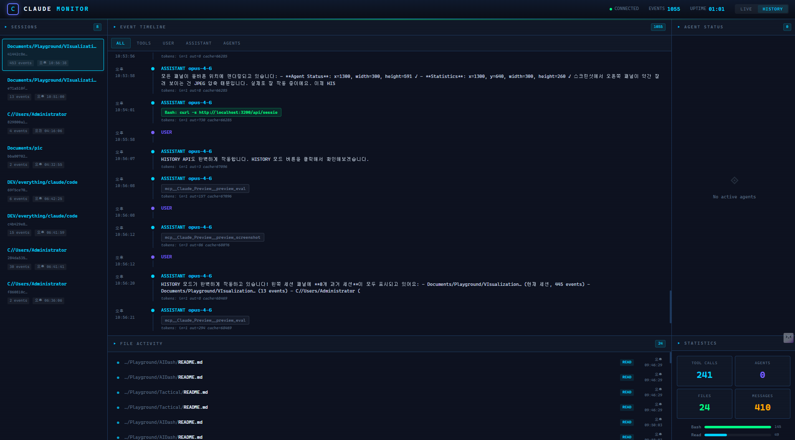

# Claude Monitor



Real-time activity dashboard for Claude Code CLI sessions. Watches JSONL log files and streams events to a cyberpunk-styled HUD via WebSocket.


## Overview

Claude Monitor tails `~/.claude/projects/**/*.jsonl` log files in real-time, parses each event, and broadcasts classified events to a browser dashboard over WebSocket. It provides full visibility into what Claude Code is doing — tool calls, file operations, subagent orchestration, and message flow — all rendered in a dark-themed cyber HUD interface.

### Key Features

- **Live Mode** — Real-time event streaming via WebSocket as Claude Code works
- **History Mode** — Browse and replay past sessions via REST API
- **5-Panel HUD Layout**
  - **Sessions** — Active/historical session list with live indicators
  - **Event Timeline** — Chronological event feed with category filters (All / Tools / User / Assistant / Agents)
  - **Agent Status** — Subagent tracking with task descriptions, tool usage, and running/idle states
  - **File Activity** — Read/Write/Edit operations with color-coded action badges
  - **Statistics** — Tool call counts, agent count, file count, message count + usage bar chart
- **Color-coded tool tags** — Read (cyan), Write (pink), Edit (amber), Bash (green), Grep (purple), Agent (orange), Skill (magenta)
- **Auto-scroll with lock** — Timeline auto-scrolls to latest; manual scroll pauses auto-scroll
- **Token usage tracking** — Input/output/cache token counts per assistant message

---

## 개요

Claude Monitor는 Claude Code CLI의 활동을 실시간으로 시각화하는 웹 대시보드입니다. `~/.claude/projects/` 하위의 JSONL 로그 파일을 감시하고, 이벤트를 파싱하여 WebSocket으로 브라우저에 스트리밍합니다.

### 주요 기능

- **실시간 모드** — Claude Code 작업 중 이벤트를 WebSocket으로 즉시 수신
- **히스토리 모드** — REST API로 과거 세션 조회 및 재생
- **5개 패널 HUD 레이아웃**
  - **Sessions** — 활성/과거 세션 목록, 라이브 표시기
  - **Event Timeline** — 시간순 이벤트 피드 (All / Tools / User / Assistant / Agents 필터)
  - **Agent Status** — 서브에이전트 추적 (태스크, 도구 사용, 실행/대기 상태)
  - **File Activity** — Read/Write/Edit 파일 작업 추적
  - **Statistics** — 도구 호출 수, 에이전트 수, 파일 수, 메시지 수 + 사용량 바 차트
- **도구별 컬러 코딩** — Read(시안), Write(핑크), Edit(앰버), Bash(그린), Agent(오렌지) 등
- **토큰 사용량 추적** — 어시스턴트 메시지별 입/출력/캐시 토큰 수 표시

---

## Architecture

```
Browser (localhost:3200)          Node.js Server
┌──────────────────────┐         ┌──────────────────────────┐
│  Sessions  │Timeline │◄──WS───┤  chokidar file watcher   │
│  ──────────┤─────────│         │  ~/.claude/projects/**   │
│  Files     │ Agents  │         ├──────────────────────────┤
│            │ Stats   │◄─REST──┤  GET /api/sessions       │
└──────────────────────┘         │  GET /api/sessions/:id   │
                                 └──────────────────────────┘
```

## Quick Start

```bash
# Install
cd claude-monitor
npm install

# Run
node server.js

# Open dashboard
# → http://localhost:3200
```

## API

| Endpoint | Description |
|----------|-------------|
| `GET /api/health` | Server status, uptime, connected clients |
| `GET /api/sessions` | List all sessions with metadata |
| `GET /api/sessions/:id` | Full event history for a session (includes subagents) |
| `ws://localhost:3200` | WebSocket — real-time event stream |

## Event Types

| Category | Source | Description |
|----------|--------|-------------|
| `user_message` | Main session | User input to Claude |
| `assistant_message` | Main session | Claude response with tool calls |
| `agent_task` | Subagent | Task dispatched to a subagent |
| `agent_response` | Subagent | Subagent tool calls and text |
| `hook` | Hooks | SessionStart, PreToolUse, PostToolUse hooks |
| `queue` | Queue | Enqueue/dequeue operations |
| `system` | System | Stop hooks, summaries |

## Tech Stack

- **Backend**: Node.js, Express, ws, chokidar
- **Frontend**: Vanilla HTML/CSS/JS (single file, no build step)
- **Data**: Claude Code JSONL log files (`~/.claude/projects/`)
- **Transport**: WebSocket (live), REST (history)
